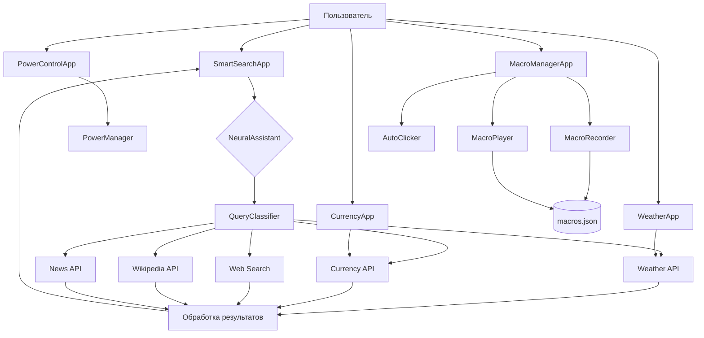

# Документация проекта Jarvis

## 1. Структура проекта

```
module/
  - currency_app.py
  - git.py
  - main.py
  - power.py
  - weather.py
```

## 2. Описание файлов

### main.py
**Назначение**: Основной файл проекта, реализующий умный поиск с использованием нейросети.

**Ключевые функции/классы**:
- `TextProcessor` - обработка текста, извлечение ключевых слов, суммирование
- `NeuralAssistant` - обработка запросов с использованием нейронных моделей
- `QueryClassifier` - классификация запросов пользователя
- `SearchThread` - поиск информации в различных источниках
- `SmartSearchApp` - основной класс графического интерфейса
- `NeuralThread` - обработка запросов в отдельном потоке
- `SpeechRecognitionThread` - распознавание речи
- `NaturalLanguageProcessor` - обработка естественного языка
- `DialogContext` - управление контекстом диалога

**Связи с другими файлами**: Является независимым модулем, но может использоваться совместно с другими компонентами.

**Краткое объяснение логики**: Приложение принимает запросы пользователя через текстовый ввод или голосовой интерфейс, анализирует их с помощью нейронных моделей, классифицирует и направляет в соответствующие модули поиска (погода, курсы валют, новости, википедия или веб-поиск). Результаты обрабатываются и представляются пользователю в удобном формате. Система поддерживает контекстные диалоги и может разрешать ссылки на предыдущие запросы.

### weather.py
**Назначение**: Модуль для получения и отображения информации о погоде.

**Ключевые функции/классы**:
- `WeatherApp` - основной класс приложения погоды
- `CitySelectionDialog` - диалог выбора города
- `WEATHER_EMOJI` - словарь эмодзи для различных погодных условий

**Связи с другими файлами**: Может использоваться из main.py для получения данных о погоде.

**Краткое объяснение логики**: Приложение позволяет выбрать город, получает данные о текущей погоде через API OpenWeatherMap и отображает их в удобном формате. Поддерживает сохранение настроек и автоматическое обновление данных.

### currency_app.py
**Назначение**: Модуль для отслеживания курсов валют и криптовалют.

**Ключевые функции/классы**:
- `CurrencyApp` - основной класс приложения для работы с валютами
- `TOP_CURRENCIES` - список основных фиатных валют
- `TOP_CRYPTOS` - список основных криптовалют
- `CURRENCY_SEARCH_DICT` - словарь для поиска валют по названиям

**Связи с другими файлами**: Может использоваться из main.py для получения данных о курсах валют.

**Краткое объяснение логики**: Приложение получает данные о курсах валют через API, отображает их в таблицах и позволяет конвертировать суммы между различными валютами. Поддерживает поиск валют, автообновление курсов и отслеживание изменений.

### power.py
**Назначение**: Модуль для управления питанием компьютера.

**Ключевые функции/классы**:
- `PowerManager` - статические методы для управления питанием
- `PowerControlApp` - графический интерфейс для управления питанием
- `SleepWorker` - поток для отсчета времени до действия

**Связи с другими файлами**: Независимый модуль.

**Краткое объяснение логики**: Приложение предоставляет интерфейс для управления питанием компьютера: переход в спящий режим, гибернация, выключение и перезагрузка. Включает таймер для отложенного выполнения этих действий.

### git.py
**Назначение**: Модуль для автоматизации действий с помощью макросов и автокликера.

**Ключевые функции/классы**:
- `MacroAction` - представление отдельного действия в макросе
- `Macro` - набор действий для автоматизации
- `MacroRecorder` - запись действий пользователя
- `MacroPlayer` - воспроизведение записанных макросов
- `AutoClicker` - автоматическое выполнение кликов мыши
- `HotkeyManager` - управление горячими клавишами
- `MacroManagerApp` - графический интерфейс для управления макросами

**Связи с другими файлами**: Независимый модуль.

**Краткое объяснение логики**: Приложение позволяет записывать последовательности действий пользователя (нажатия клавиш, движения мыши, клики) и воспроизводить их по горячим клавишам или голосовым командам. Включает функцию автокликера с настраиваемой скоростью и режимом "антидетект" для имитации человеческого поведения.

## 3. Архитектура проекта

### Общая структура
Проект представляет собой набор независимых модулей, каждый из которых решает определенную задачу. Центральным компонентом является `main.py`, реализующий интеллектуальный поиск с использованием нейронных сетей. Остальные модули предоставляют дополнительную функциональность: информация о погоде, курсы валют, управление питанием и автоматизация действий.

### Потоки данных
1. **Ввод пользователя** → **Обработка запроса** → **Классификация** → **Поиск информации** → **Обработка результатов** → **Вывод пользователю**
2. **API-запросы** → **Обработка данных** → **Отображение в интерфейсе**
3. **Действия пользователя** → **Запись макросов** → **Сохранение** → **Воспроизведение по триггеру**

### Диаграмма архитектуры



## 4. Библиотеки/фреймворки

### PyQt6
**Назначение**: Создание графического интерфейса пользователя
**Где используется**: Во всех модулях для построения GUI

### Requests
**Назначение**: Выполнение HTTP-запросов к API
**Где используется**: main.py, weather.py, currency_app.py для получения данных

### NLTK (Natural Language Toolkit)
**Назначение**: Обработка естественного языка
**Где используется**: main.py для анализа текста, токенизации, удаления стоп-слов

### BeautifulSoup
**Назначение**: Парсинг HTML
**Где используется**: main.py для обработки результатов веб-поиска

### Wikipedia
**Назначение**: Доступ к данным Википедии
**Где используется**: main.py для поиска информации в Википедии

### DuckDuckGo Search
**Назначение**: Поиск информации в интернете
**Где используется**: main.py для веб-поиска

### SpeechRecognition
**Назначение**: Распознавание речи
**Где используется**: main.py для голосового ввода

### Scikit-learn
**Назначение**: Машинное обучение
**Где используется**: main.py для классификации запросов

### Sentence-Transformers
**Назначение**: Векторное представление текста
**Где используется**: main.py для семантического анализа

### Transformers (Hugging Face)
**Назначение**: Работа с трансформерными моделями
**Где используется**: main.py для генерации ответов

### PyNput
**Назначение**: Управление клавиатурой и мышью
**Где используется**: git.py для записи и воспроизведения макросов

## 5. Точка входа и запуск

Каждый модуль имеет свою точку входа и может запускаться независимо:

```python
# Запуск умного поиска
python main.py

# Запуск приложения погоды
python weather.py

# Запуск приложения курсов валют
python currency_app.py

# Запуск приложения управления питанием
python power.py

# Запуск менеджера макросов
python git.py
```

При запуске каждого модуля создается экземпляр основного класса приложения, инициализируется интерфейс и запускается цикл обработки событий Qt.

## 6. Архитектурные особенности

### Многопоточность
Проект активно использует многопоточность для выполнения длительных операций без блокировки интерфейса пользователя:
- `SearchThread` в main.py для поиска информации
- `NeuralThread` в main.py для обработки запросов нейросетью
- `SpeechRecognitionThread` в main.py для распознавания речи
- `SleepWorker` в power.py для отсчета времени
- `AutoClicker` в git.py для автоматических кликов

### Модульность
Каждый компонент проекта реализован как независимый модуль, что обеспечивает:
- Возможность использования компонентов по отдельности
- Простоту поддержки и расширения функциональности
- Четкое разделение ответственности

### Использование API
Проект интегрируется с различными внешними API:
- OpenWeatherMap для данных о погоде
- Exchange Rate API для курсов валют
- CoinGecko для данных о криптовалютах
- DuckDuckGo и Bing для веб-поиска
- Wikipedia API для энциклопедических данных
- NewsData.io для новостей

### Антидетект-режим
В git.py реализован "антидетект-режим", который добавляет случайные задержки и микродвижения для имитации человеческого поведения при воспроизведении макросов и использовании автокликера.

### Контекстный диалог
В main.py реализована система управления контекстом диалога, которая позволяет разрешать ссылки на предыдущие запросы и поддерживать непрерывную беседу с пользователем.

### Причины выбора архитектуры
1. **Модульность**: Обеспечивает гибкость и масштабируемость проекта
2. **PyQt6**: Предоставляет богатый набор инструментов для создания кроссплатформенных интерфейсов
3. **Многопоточность**: Обеспечивает отзывчивость интерфейса при выполнении длительных операций
4. **Интеграция с API**: Позволяет получать актуальные данные из различных источников
5. **Нейронные сети**: Обеспечивают интеллектуальную обработку запросов пользователя
